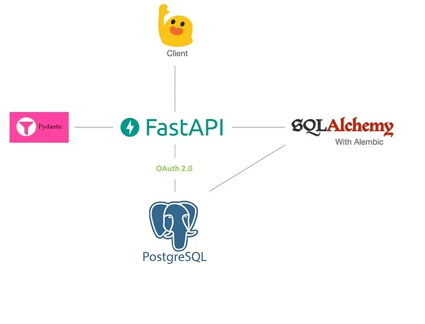

# RIFA SOCIAL APP

Backend de una aplicación para Registrar CLIENTES por medio de RIFAS, que promocionan PREMIOS, que pertenecen a un SORTEO

** Presentación: https://youtu.be/NYa45Mxh3cQ**

El diagrama de la app es el siguiente:

 
 
El curso online que me sirvió de guía es el siguiente:

- https://www.youtube.com/watch?v=ToXOb-lpipM

Gracias Sanjeev!
